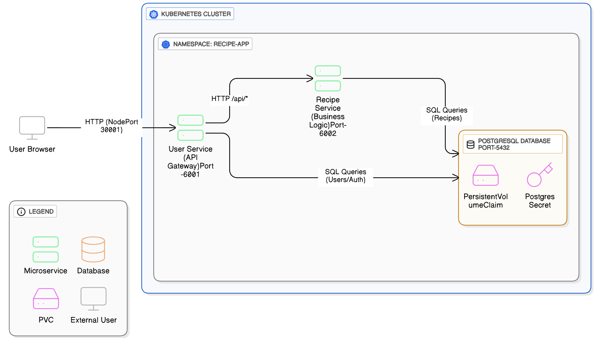

# Recipe Sharing Microservices Application

## 📝 Project Description

This is a modern, microservices-based web application for sharing recipes. The application allows users to sign up, log in, add their own recipes, and search for recipes shared by others. It is designed and deployed using **Kubernetes** to demonstrate best practices in cloud-native development.

## ✨ Key Features

  * **User Authentication**: Secure user registration and login functionality.
  * **Recipe Management**: Users can create, list, and view their personal recipes.
  * **Persistent Data Storage**: All user and recipe data is stored in a persistent **PostgreSQL** database.
  * **Containerized Services**: The entire application is containerized using **Docker**.
  * **Microservices Architecture**: The application logic is separated into independent, single-purpose services for enhanced modularity and scalability.
  * **External Access**: The application is accessible from outside the Kubernetes cluster via a NodePort service.

## 🏛️ Architecture

The application is built on a microservices architecture, with each component running as a separate service orchestrated by **Kubernetes** to ensure scalability and reliability.
### Architecture Diagram


### Services

  * **`user-service`**: A Flask-based service that handles user authentication (signup, login).
  * **`recipe-service`**: A Flask-based API that manages all recipe data and communicates directly with the database.
  * **`postgres`**: A PostgreSQL database for persistent data storage.


-----

## 🚀 Getting Started

Follow these steps to set up and run the project on your local machine using Minikube. The Docker images are pre-built and hosted publicly, so there is no need to build them. Make sure Docker Desktop is running in the background.

### Prerequisites

  * **Docker Desktop**: Running in the background.
  * **Minikube**: Ensure it's installed and running.
  * **kubectl**: Installed and configured to communicate with your Minikube cluster.
  * **Git**: For cloning the repository.

### 1\. Clone the Repository

```sh
git clone https://github.com/hemanthanne411/Recipe-Sharing-Hub-main.git
cd Recipe-Sharing-Hub-main/k8s
```

### 2\. Prepare the Environment

First, you need to create the Kubernetes namespace for the application and then create the secret for the database password.

```sh
# Create the namespace for the application
kubectl apply -f namespace.yaml

# Create the Kubernetes Secret for the database password
kubectl create secret generic postgres-password-secret --from-literal=password=mysecretpassword1011 -n recipe-app
```

### 3\. Deploy to Kubernetes

Apply all the Kubernetes manifest files to deploy your application's services and configurations into the `recipe-app` namespace.

```sh
kubectl apply -f . -n recipe-app
```

### 4\. Check Pod Status

Verify that all your microservice pods are running correctly. The status should show `Running` for all of them.

```sh
kubectl get pods -n recipe-app
```

### 5\. Access the Application

The `user-service` is exposed as a `NodePort` service. To get the URL to access the application, run this command and open the URL in your web browser.

```sh
minikube service user-service --namespace=recipe-app --url
```

-----

## 📦 Project Structure

```
.
├── user-service/
│   ├── app.py
│   ├── templates/
│   │   ├── ...(html templates)
│   └── Dockerfile
├── recipe-service/
│   ├── app.py
│   └── Dockerfile
├── k8s/
│   ├── postgres-init-configmap.yaml
│   ├── postgres-pv-claim.yaml
│   ├── postgres-service.yaml
│   ├── postgres-deployment.yaml
│   ├── userservice-service.yaml
│   ├── user-deployment.yaml
│   ├── recipeservice-service.yaml
│   └── recipe-deployment.yaml
└── README.md
```

*Note: Parts of this README (including the architecture diagram) were created with the help of Generative AI.*